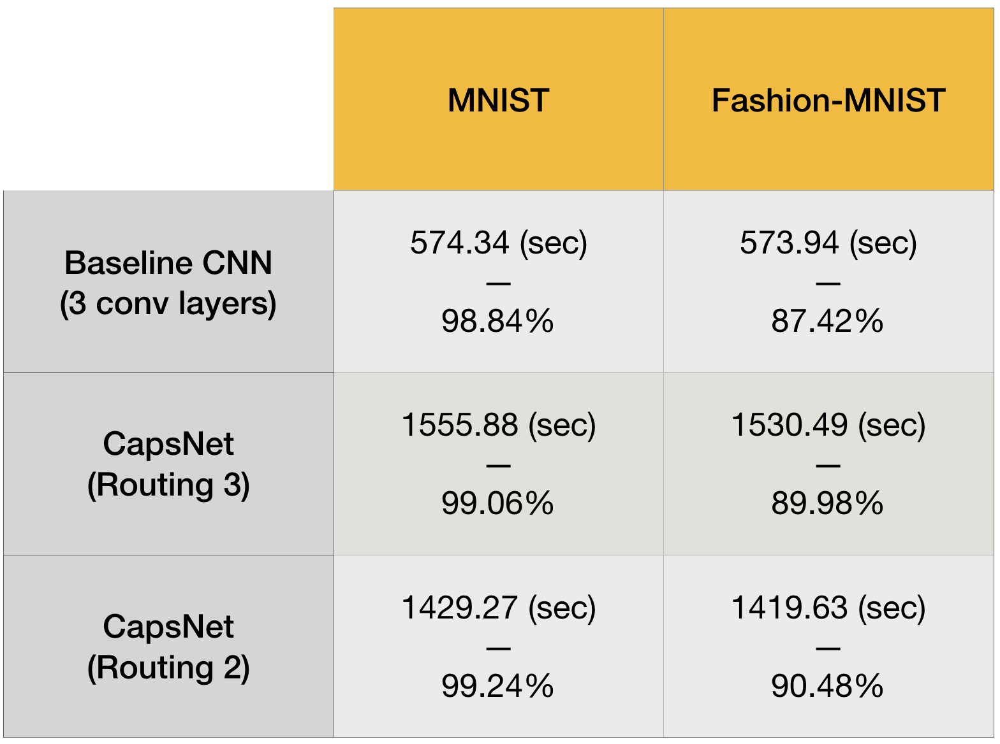

## Motivation 

The main idea behind this implementation was to answer the following question: 

_How does the training time of CapsNet-based models compare with the training time of 
CNN-based models?_ 

To answer this question, the reference CapsNet model from the [paper](https://arxiv.org/abs/1710.09829) has been 
compared with the baseline CNN model from the same paper, in terms of their training time on MNIST and Fashion-MNIST datasets.

## Implementation

A forked CapsNet implementation from [here](https://github.com/naturomics/CapsNet-Tensorflow) has been compared with 
baseline CNN model implemented in Tensorflow.

As mentioned in the paper, the baseline is a standard CNN with three convolutional layers of 256, 256, and 128 channels, 
witheach layer consisting of 5x5 kernels and stride of 1. Following the convolutional layers, there are two fully 
connected layers of size 328 and 192. 
The last fully connected layer is connected with dropout to the 10-class softmax classifier output layer.

## Computational Resources Specification

Google Colab was used to implement and evaluate the models. 
Both CapsNet and baseline CNN models were trained on one Tesla K80 12GB GDDR5 VRAM GPU.

## Choice of Hyperparameters

For the baseline CNN model, dropout probability of 0.25 was used.
The learning rate was initialized to 0.005 and decayed exponentially to 0.0001 as described by the following formula:

`learning_rate = lr_min + (lr_max-lr_min) * e^(-i/2000)`

where `$lr_min=0.0001, lr_max=0.005` and `i` is the iteration.

For the CapsNet model we used two different values (2 and 3) for the number of routing iterations.

The batch size used in both models was 100.

_These parameters were not particularly specified in the paper._

## Results

### Comparison of training times
The comparison of average training times for both models was done for 10 epochs. 
The training time is given in seconds and accuracy in percentage of correct predictions out of total predictions. 
The accuracy was measured after running the model on 5000 images from each test set.

*`A delta of +- 50 sec difference could be observed in the training times`

**As the results show, the CapsNet model training time is almost three times the Baseline CNN model on both MNIST and Fashion-MNIST. 
However, this relationship between the times of two models cannot be generalized to more sophisticated datasets and 
that is something that needs to be investigated further.** 
